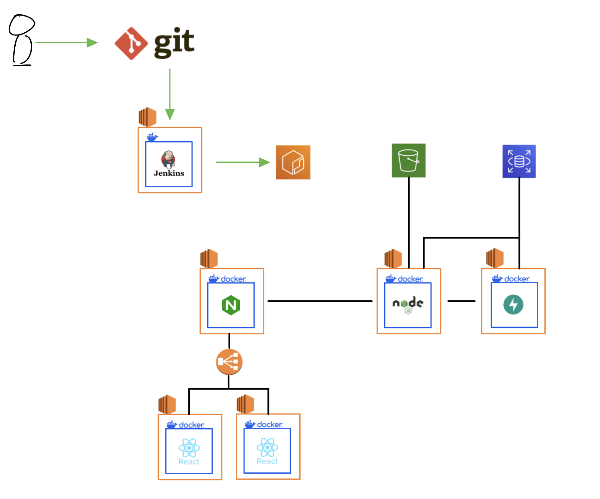
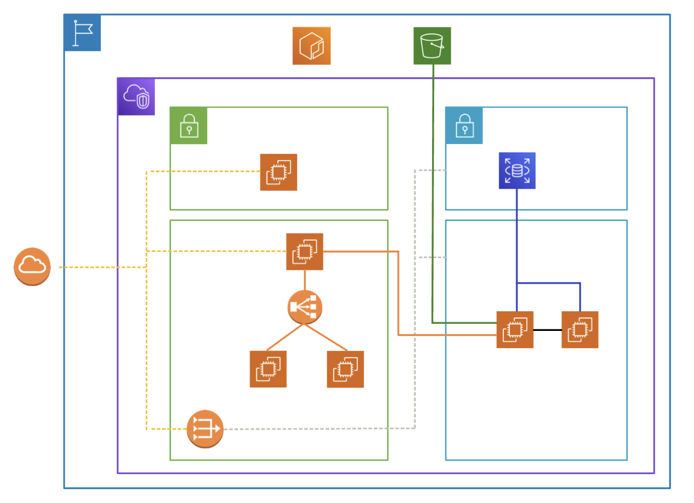

### Team20의 클라우드 진행 계획 - Lyle

- 팀과의 회의 이후
1. 네트워크 구성 - VPC, Subnet(public, private), NAT, IGW
2. 프론트 인스턴스 구성
3. NGINX 인스턴스 구성 및 테스트
4. 백엔드 인스턴스 구성 및 테스트
5. AI api 인스턴스 구성 및 테스트
6. RDS 인스턴스 구성 및 테스트

### 기술 스택 및 아키텍처 구성

- 설계 의도
    - 각 인스턴스 당 하나의 컨테이너: 단일 책임 원칙
    - 젠킨스 : CI 과정 자동화
    - 프론트 서버 2개: 사용자가 많이 몰릴 것을 대비
    - Nginx : 프론트, 백엔드 라우터 역할
        - 프론트 서버를 한개만 사용한다면 굳이 쓸 이유가 없음
    - node.js : 메인 백엔드 서버
    - fast api : ai 서비스를 위한 api서버
    - RDS : 똑같은 데이터를 사용하는 백엔드 서버가 2개이므로 DB에 많은 부담 
    ⇒  확장성과 성능을 보장 받을 수 있기 때문
    - S3: 정적 데이터 저장(이미지)
    - ECR: 젠킨스를 통해 빌드된 이미지를 저장하고 각 인스턴스에 배포시키기 위함
- 왜 이런건 안썼나요?
    - Terraform& Ansible: 메인 서버 / 테스트 서버 / 개발 서버로 각각 나뉜다면 해당 동일한 구조를 여러번 반복 세팅해야 할 필요가 있어 쓰지만 → 저희 팀 프로젝트는 개발 및 서비스가 따로 나뉘지 않고 단일 구조로 진행되기에 Terraform과 Ansible을 사용하지 않습니다
    - Docker-Compose : 해당 프로젝트에서 단일 책임 원칙에 의해 하나의 인스턴스(컨테이너)에 하나의 역할만 수행하도록 설계하여 컨테이너를 하나만 실행시키기에 동시에 여러개를 띄우는 docker-compose는 사용하지 않습니다.
    - Kubernetes: 쿠버네티스를 사용할정도로 서비스를 크게 책정하지 않았습니다.
    - ArgoCD 안쓰나요? 쿠버네티스 안써서 안씁니다.
    - CD 어디갔나요?: 젠킨스를 통해 CI를 구성하고 ECR에서 젠킨스를 통해 CD도 진행하려 했으나 프라이빗 서브넷으로의 배포 파이프라인을 구성하는 난이도가 배보다 배꼽이 더 큰 것같아 포기했습니다.
    - 모니터링 안하나요? : 클라우드 혼자라 넘보지 않았습니다.
    - 그 이외 : 생각조차 안해봐서 몰랐습니다.

### 네트워크 구성

- **설계 의도**
    - Subnet
        - 배포를 위한 서브넷
        - 프론트 서비스를 하기 위한 서브넷
        - 데이터 저장을 위한 서브넷
        - 데이터 처리를 위한 서브넷
    - VPC: 서브넷끼리 통신 시키기 위함
    - NAT: 프라이빗 서브넷의 인터넷 통신을 위함
    - ALB: 2개의 프론트 웹 로드밸런싱
